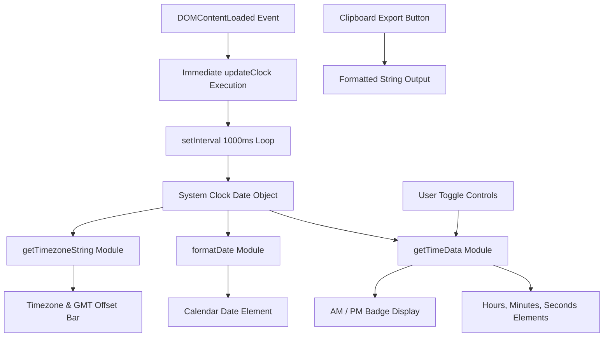

# Digital Clock Studio - Precision Real-Time Chronometer

[](https://developer.mozilla.org/en-US/docs/Web/HTML)
[](https://developer.mozilla.org/en-US/docs/Web/CSS)
[](https://developer.mozilla.org/en-US/docs/Web/JavaScript)
[](https://nodejs.org/)
[](https://opensource.org/licenses/MIT)

A modern, high-precision digital clock studio application designed with glassmorphism aesthetics, dynamic timezone recognition, and interactive time formatting. Built entirely with vanilla web standards and zero external runtime dependencies.

---

## Overview

Digital Clock Studio delivers seamless time synchronization directly in the browser. It eliminates common initial delay artifacts by executing instant hydration on page load, presents a calendar date display, detects local timezone information, and supports both standard 12-hour and military 24-hour presentation formats.

---

## Key Features

- **Instant Initialization**: Computes and renders precise time immediately upon DOM load, eliminating initial zero-state delay.
- **Dual Display Modes**: Seamless switching between 12-Hour (AM/PM) and 24-Hour military formats.
- **Synchronized Calendar**: Real-time day of week, month, day number, and year tracking.
- **Automatic Timezone Detection**: Identifies system timezone and computes active GMT/UTC offsets via standard internationalization APIs.
- **Jitter-Free Monospace Typography**: Leverages JetBrains Mono tabular numbers to prevent layout shifting during digit increments.
- **Interactive Colon Animations**: Toggleable synchronized pulse blink effect for visual cadence.
- **Timestamp Clipboard Export**: One-click copy utility for formatted timestamps and active date strings.
- **Responsive Glassmorphic Design**: Tailored viewport scaling from mobile devices to desktop monitors.

---

## Architecture & Data Flow



---

## Project Structure

```text
Digital-Clock/
├── .gitignore        
├── index.html        
├── README.md          
├── script.js         
├── style.css          
└── tests/
    └── test_clock.js  
```

---

## Getting Started

### Prerequisites

- Any modern web browser (Google Chrome, Mozilla Firefox, Microsoft Edge, Apple Safari)
- Optional: Node.js (version 16 or newer) for executing the automated test suite

### Running the Application

1. Clone the repository:

```bash
git clone https://github.com/Kumar44developer/Digital-Clock.git
cd Digital-Clock
```

2. Open the application directly in your browser:

Launch the file via system default browser:

```bash
start index.html
```

Or serve via an HTTP server:

```bash
npx serve .
```

---

## Automated Testing

The repository contains an automated unit test suite testing leading zero padding, 24-hour midnight and afternoon boundaries, 12-hour AM/PM transitions, and date formatting.

Run the test suite using Node.js:

```bash
node tests/test_clock.js
```

Expected output:

```text
Running Digital Clock Unit Tests...

PASS: Leading zeros pad single-digit hours/minutes/seconds properly
PASS: 24-Hour midnight displays as '00:05:09'
PASS: 24-Hour afternoon displays as '15:30:45'
PASS: 12-Hour midnight displays as '12:05:09 AM'
PASS: 12-Hour noon displays as '12:00:00 PM'
PASS: 12-Hour afternoon 15:30 displays as '03:30:45 PM'
PASS: Date formatted accurately as 'Sunday, September 20, 2026'

All 4 Digital Clock unit test suites passed successfully!
```

---

## Technical Specifications

| Component | Technology | Specification |
| :--- | :--- | :--- |
| Markup | HTML5 | Accessible container structure, semantic badges |
| Styling | CSS3 | Flexbox, tabular numerals, glassmorphic backdrop filter |
| Typography | Google Fonts | JetBrains Mono (digits) and Outfit (interface) |
| Core Engine | JavaScript (ES6+) | Event-driven timers, Intl.DateTimeFormat API |
| Testing | Node.js | Native assertion harness |

---

## Browser Support

- Google Chrome: Version 88+
- Mozilla Firefox: Version 85+
- Microsoft Edge: Version 88+
- Apple Safari: Version 14+
- iOS Safari & Chrome Mobile

---

## License

This project is licensed under the MIT License. Open source and available for personal and commercial use.
